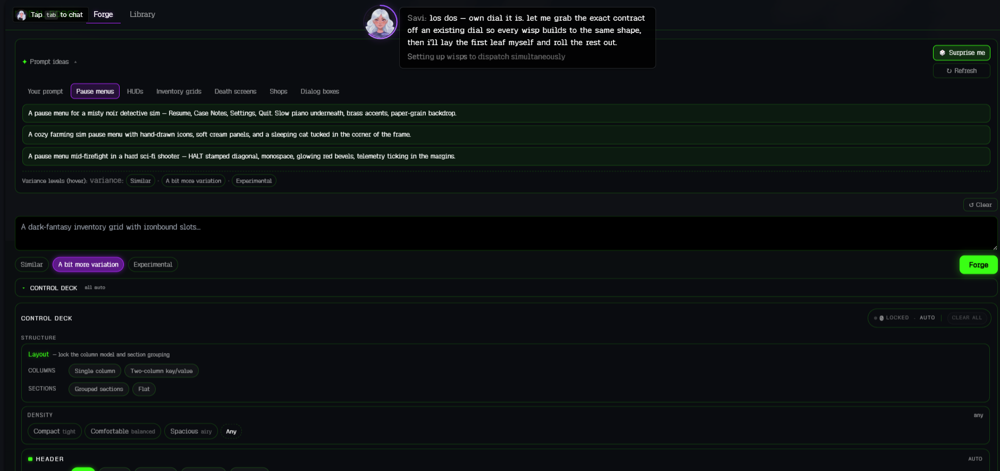
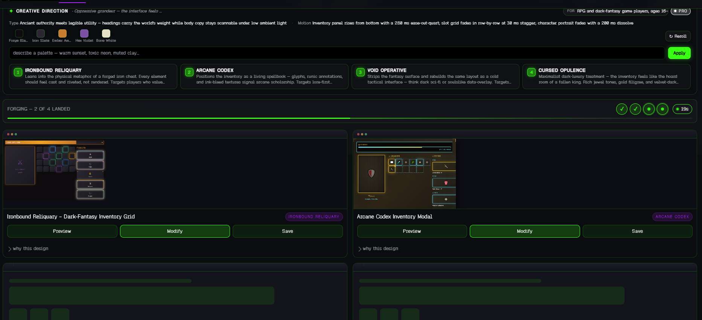
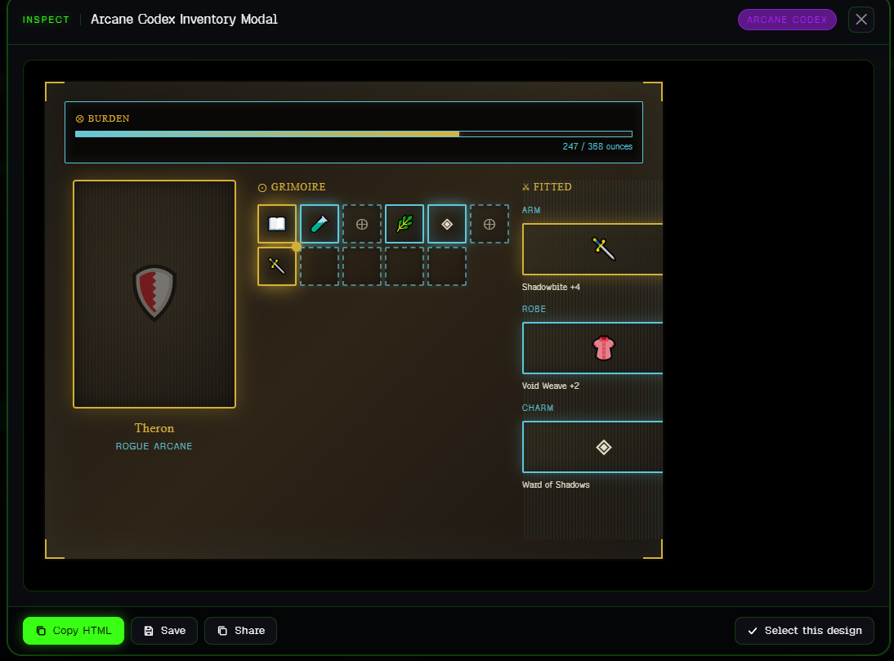
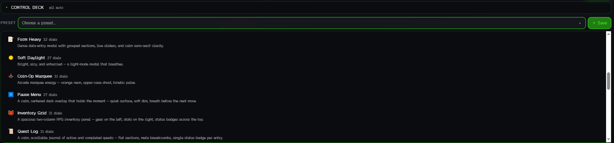

# Modal Forge

> **One Prompt. Four Takes. Complete Control.**  
> A powerful generative UI design engine from **Spawn.co** that turns plain-language prompts into functional, production-ready modal and dialog designs.

Modal Forge bridges the gap between creative prompt-to-UI generation and fine-grained, developer-level layout and behavior controls. It outputs complete, visually distinct layouts in functional HTML/CSS, ready to be customized, hybridized, and saved.

---

## 🚀 What it is
Modal Forge turns a plain-language prompt into **four distinct, ready-to-use modal/dialog UI designs** at once. You describe what you want, the Forge generates four "takes" (real HTML/CSS), and you pick the closest design to refine. 

Using the **Forge Director**, you can combine two results (hybridize), mutate individual modals, and export clean production code. For absolute control, the **Control Deck** allows you to lock design decisions to constrain and guide the generative process.

---

## 🛠️ Core Capabilities
*   **One Prompt → Four Takes:** Every forge request returns four completely distinct structural and visual interpretations, not simple color swaps.
*   **Forge Director Pipeline:** Your prompt is first compiled into a structured creative *brief* specifying type scale, visual metaphors, palette swatches, and motion curves. The four modals are then forged to match this brief for highly intentional results.
*   **Dynamic Palette Engine:** Automatically generates and balances a cohesive color palette per forge. Re-roll color palettes or specify them directly in prompts.
*   **Clarifier Module:** If a prompt is too ambiguous, Modal Forge prompts you with one quick clarifying question before spinning up the wisps.
*   **Hybridize (Breed):** Select any two generated modals and blend them to produce a child design that inherits structural and style traits from both.
*   **Mutate (Variant Spin-off):** Take a single design and generate four fresh variants focused on tweaking specific sections.
*   **Library & Saving:** Bottle up your favorite designs with custom names, tags, and categories.
*   **Share & Publish (The Nexus):** Publish your creations directly to the public catalog or share them with the Spawn.co community.
*   **Control Deck:** A control panel with **25 dials** to lock visual, layout, and behavioral settings, plus **34 presets** to instantly snap the editor to specific configurations.

---

## 🔄 The Design Loop (How to Use It)
1.  **Describe it:** Type your prompt (or use the starter pills in the empty state). Select a *Variance pill* (Similar, A bit more variation, Experimental) to control how wild the takes run.
2.  **Forge:** Hit the **Forge** button. The progress bar will update as the generative wisps dispatch.
3.  **Pick:** Inspect the four card outputs and select the take closest to your design goal.
4.  **Refine:** 
    *   **Hybridize** two cards you like to merge their characteristics.
    *   **Mutate** a single card to generate a sub-generation of variants.
    *   Open the **Control Deck**, lock critical parameters (e.g., density, columns, borders), and re-forge.
5.  **Save:** Save your favorite cards directly to your library with category metadata.
6.  **Export & Share:** Copy the generated HTML/CSS code or publish it.

> 💡 **Tip:** The Control Deck is *additive*. Leaving dials on "auto" lets the AI innovate in those areas, while locking a few specific dials ensures compliance with your constraints.

---

## 🎛️ Control Deck Dials & Modules

The Control Deck contains **32 ctl-modules**: **25 actual dials** and **7 infrastructure/assembly pieces**.

### 🏗️ Infrastructure & Assembly (7 Modules)
These modules are the underlying code blocks that assemble, route, and package the settings of your deck:
*   `ctl-deck-shell` — Client-side panel assembler that structures the Control Deck UI.
*   `ctl-mi-shell` — Sub-panel assembler housing the Motion Intelligence dials.
*   `ctl-forge-bridge` — Bridges the active UI deck states into JSON for the backend forge API.
*   `ctl-brief-compose` — Server-side aggregator that compiles locked dials into the strict brief constraints block.
*   `ctl-mi-compose` — Motion coherence engine ensuring Motion Intelligence settings do not conflict.
*   `ctl-presets` — The core library containing the **34 built-in presets** (and custom user-saved presets).
*   `ctl-summary-chip` — The active counter pill in the UI showing how many settings are locked.

---

### 📐 Layout & Structure Dials (6 Dials)
*   `ctl-layout` — Columns structure (Single column / Two-column key-value) and section groupings (Grouped / Flat).
*   `ctl-sizing` — Lock the modal's outer width boundaries + optional grid snaps.
*   `ctl-density` — Margins and padding density scale (Compact tight / Comfortable balanced / Spacious airy / Any).
*   `ctl-header` — Header layout: title position, breadcrumbs, icons, and close button alignment.
*   `ctl-footer` — Footer design styling (Gradient overlay / Solid surface / Ghost panel) and action alignment.
*   `ctl-identity` — Branding/logo overlay placements and identity treatment.

---

### 🎨 Theme Dials (5 Dials)
*   `ctl-theme-accent` — Accent color selector (Cyan / Magenta / Terminal-green / Orange / Violet).
*   `ctl-theme-mode` — Visual theme base (Light mode / Dark mode) + corner decoration (Sharp / Glow / Rounded / Pill).
*   `ctl-theme-surface` — Backdrop surface treatment (Flat solid / Gradient / Neon wash / Outline borders).
*   `ctl-theme-sections` — Color-coding structures (Monochrome vs. coded layout elements).
*   `ctl-theme-type` — Typography styles (Monospace fonts / Clean Sans-serif, label text casing).

---

### 🎬 Motion Dials (3 Dials)
*   `ctl-motion-entrance` — Modal load easing (Linear / Ease-out / Spring / Snappy) + entrance duration.
*   `ctl-motion-hover` — Interactive hover-feel intensity (Off / Soft glow / Snappy scale).
*   `ctl-motion-backdrop` — Modal background backdrop blur radius and dimming percentage.

---

### 🧠 Motion Intelligence Dials (5 Dials)
*   `ctl-mi-tone` — Overall animation vibe (Calm / Playful / Aggressive / Elegant / Mysterious).
*   `ctl-mi-energy` — Velocity of transitions (Subtle / Gentle / Lively / Kinetic).
*   `ctl-mi-layers` — Layered animations activation (Entrance / Hover / Scroll / Parallax / Idle loops).
*   `ctl-mi-platform` — Environment profile mapping (Web UI / Mobile layout / Kiosk screen / Game UI overlay).
*   `ctl-mi-signature` — Custom visual fx overlay (CRT screen flicker / Holographic drift / Neon pulse / Particle trails / Mouse parallax).

---

### 🧩 Component Palette Dials (5 Dials)
*   `ctl-comp-choice` — Styling format for check grids, selection buttons, and radio modules.
*   `ctl-comp-inputs` — Layout properties of input fields (text forms and number dials).
*   `ctl-comp-rows` — Formatting for list panels, datagrids, and stats indicators.
*   `ctl-comp-sliders` — Interactive slider handles styling (Off / Basic slider / Slider with units / Live readout).
*   `ctl-comp-toggles` — Look-and-feel of switches, state indicators, and colored badges.

---

### ⚙️ Behavioral Dial (1 Dial)
*   `ctl-behavior-flags` — Set 4 key modal triggers:
    1. `backdrop-click-to-close` (dismiss modal on overlay click)
    2. `lock-background-scroll` (prevent parent page scrolling)
    3. `sticky-footer` (affixed footer buttons)
    4. `scrollable-body` (enable content scrolling inside modal)

---

## 📸 Interface Preview

Here are some key screenshots of the Modal Forge application in action:

| Screen Description | View |
| :--- | :--- |
| **Main Forge Workspace:** Describe modal concepts, choose variance, and toggle Control Deck parameters. |  |
| **Creative Direction Planner:** Define typographic hierarchy, motion stagger patterns, and color palettes. |  |
| **Modal Inspection View:** View generated layout components like Grimoire inventory grids, Fitted items, and burden metrics. |  |
| **Control Deck Preset Snapping:** Select from presets like *Pause Menu*, *Form Heavy*, *Quest Log* to auto-lock parameters. |  |

---

## 💻 Tech & Development
Modal Forge is a component of the Spawn.co ecosystem. The generated modals run on clean, vanilla HTML/CSS and can be integrated into web structures, gaming overlays, and application dashboards.

*   *License:* Spawn.co Proprietary
*   *Support:* Visit Spawn.co for questions and documentation updates.
